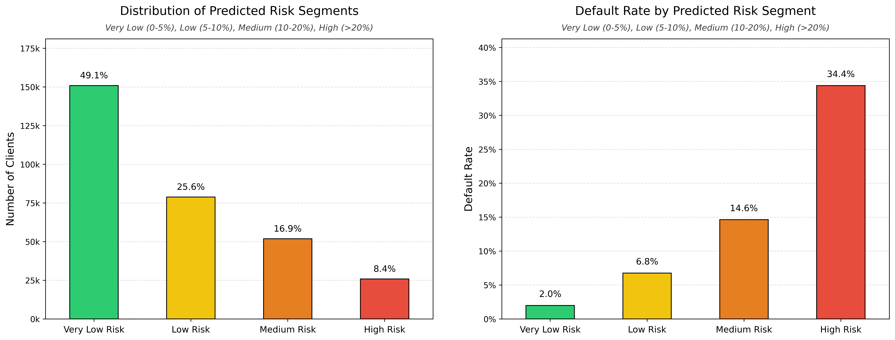

# Default Risk Assessment

End-to-end credit risk modeling and customer segmentation using the [Home Credit Default Risk dataset](https://www.kaggle.com/c/home-credit-default-risk) with implementation of LightGBM classification for loan default prediction.

📄 **[Project Slides](04_reporting_PowerBi/Report_Slides.pdf)** | 📊 **[Dashboards](04_reporting_PowerBi/Home_Credit_Dashboards.pdf)**


## Overview

Home Credit provides loans to customers with limited or no credit history, typically rejected by traditional banks. This project develops a predictive model to assess loan default risk and segment customers by risk level to inform lending decisions and enable differentiated lending strategies.

The dataset consists of over 307,000 loan applications with application details, applicant profiles, and external data from credit bureau history and previous Home Credit applications. As a first step, data integration and preprocessing was performed in BigQuery using SQL to combine multiple data sources and construct historical credit behavior profiles from bureau records and previous applications. Following this preparation, feature engineering and modeling was conducted locally in Python, developing both a logistic regression baseline and a LightGBM model with systematic hyperparameter tuning via stratified cross-validation and final model selection on the test set. To enable risk-based strategies, customers were segmented into four risk categories based on predicted default probabilities, ranging from Very Low to High Risk of default. Following this segmentation, a profile analysis was conducted to explore the relationships between risk levels and key predictive features across demographic, employment, and credit dimensions. Lastly, three interactive Power BI dashboards were built to communicate model performance, risk distributions, and segment characteristics to support data-driven credit evaluation strategies.

<br>

<p align="center">
  
</p>

<br>


## Key Findings

The LightGBM model achieved strong performance in ranking default risk, with 0.758 AUC demonstrating effective discrimination between defaulting and repaying customers. Threshold optimization via cross-validation resulted in a recall rate of 69.5%, capturing the majority of actual defaults while maintaining reasonable precision given the highly imbalanced dataset. Among the features used, organization type, external data sources, credit amount, applicant age, and employment characteristics emerged as the strongest predictors, with the model effectively capturing complex patterns across demographic, financial, and behavioral dimensions.

Risk segmentation validated clear separation across the four tiers, with default rates progressively increasing from 2.0% in Very Low Risk to 34.4% in High Risk segments. Profile analysis revealed systematic patterns distinguishing risk categories. Higher-risk applicants demonstrate younger age profiles, shorter employment tenure, and lower education levels, alongside credit history patterns of prior loan refusals and multiple active bureau loans.

<br>

<p align="center">
  
</p>

<br>

## Business Recommendations

Building on the risk segmentation results, several practical actions can support more efficient and profitable lending decisions. Very low risk applicants, representing 49% of applications with only a 2.0% default rate, can be processed through automated approvals to reduce manual screening work and speed up application processing. Review efforts can then be focused on medium and high risk segments that require deeper evaluation. A risk based pricing strategy with differentiated interest rates and flexible repayment terms can further enable approvals for higher risk customers through appropriate risk compensation. Finally, insights on feature risk relationships can be incorporated into credit evaluation to support decision making in borderline or uncertain cases.


## Repository Structure
```
Home_Credit_Default_Risk_Assessment/
├── 01_data_preprocessing_SQL/         # BigQuery scripts for data integration and cleaning
├── 02_feature_development_Python/     # Feature engineering and selection notebooks
├── 03_modeling_segmentation_Python/   # Model training, evaluation, and risk segmentation
├── 04_reporting_PowerBi/              # Dashboard file and presentation slides
├── data/
│   ├── processed/                 # Cleaned and feature-engineered datasets
│   └── raw/                       # Original Home Credit data (not included, download from Kaggle)
├── images/                        # Visualizations and dashboard screenshots
├── modules/                       # Reusable Python functions for preprocessing and modeling
└── environment.yml                # Conda environment for reproducibility
```


## License

MIT License
